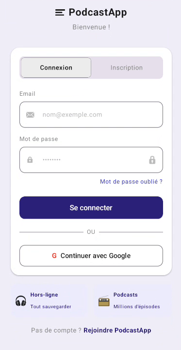
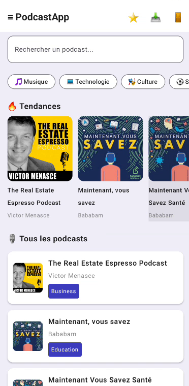
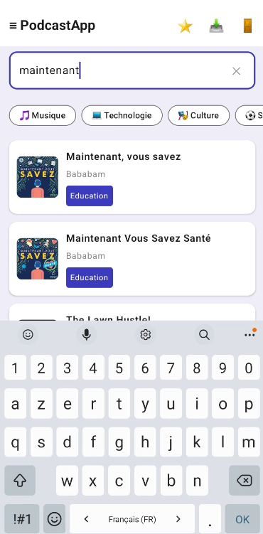
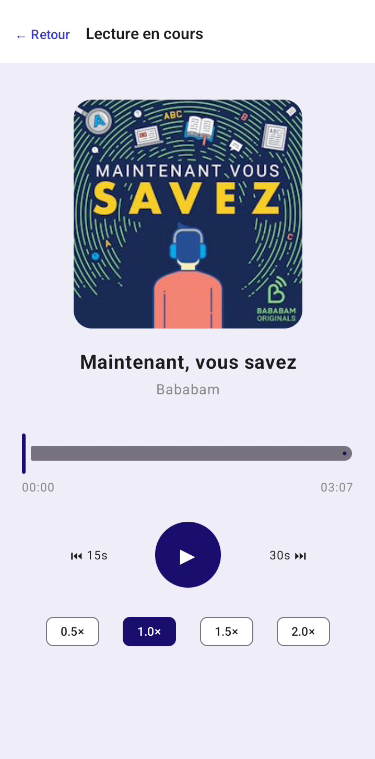
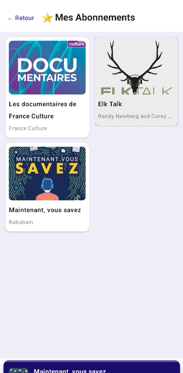
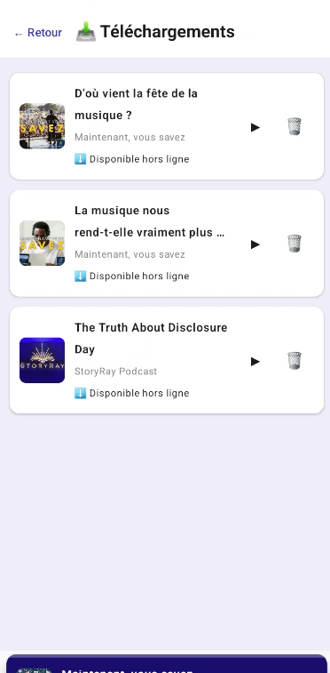

# 🎙️ PodcastApp

> **Application Android de découverte et d'écoute de podcasts** — Projet de Fin de Module (Master DevOps & Cloud Computing)

[](https://www.android.com)
[](https://kotlinlang.org)
[](https://developer.android.com/jetpack/compose)
[](LICENSE)

---

## 👥 Équipe

| Rôle | Nom | Responsabilités |
|------|-----|-----------------|
| **Lead Technique / Product Owner** | QALQOL REDA | Architecture, API, lecteur audio, tests |
| **UI & Design System / Scrum Master** | KELTOUMA ACHGUER | Interface, design système Material 3, i18n, logo |

**Université :** Abdelmalek Essaïdi — Faculté Polydisciplinaire de Larache  
**Master :** DevOps et Cloud Computing (2025-2026)  
**Encadrant :** Mohamed KOUISSI  
**GitHub :** [kelt-ac/Projet-Android-PodcastApp](https://github.com/kelt-ac/Projet-Android-PodcastApp)

---

## 📋 Description

PodcastApp est une **application mobile Android native** permettant aux utilisateurs de :

- 🔍 **Découvrir** des podcasts par catégorie, popularité ou recherche textuelle
- 🎧 **Écouter** les épisodes avec un lecteur audio complet (contrôles, vitesse variable)
- 📥 **Télécharger** des épisodes pour une écoute hors connexion
- ❤️ **S'abonner** à des chaînes de podcasts et gérer leurs abonnements
- 👤 **Gérer** profil, préférences et historique d'écoute
- 🌍 **Accéder** en Français, Anglais ou Arabe (RTL)
- 🌓 **Adapter** l'interface au mode sombre du système

---

## ✨ Fonctionnalités implémentées

### ✅ Sprint 1 — Authentification
- Inscription/Connexion avec email et mot de passe (Firebase Auth)
- Single Sign-On (SSO) via Google avec Credential Manager
- Persistance de session sécurisée (DataStore)
- Déconnexion et suppression de compte

### ✅ Sprint 2 — Découverte de Podcasts
- Affichage de podcasts populaires et tendances (HomeScreen)
- Recherche en temps réel par titre ou auteur
- Filtres par catégorie (Technologie, Culture, Sport, etc.)
- Page détail podcast avec liste d'épisodes paginée
- Layout adaptatif pour tablettes (WindowSizeClass)

### ✅ Sprint 3 — Lecteur Audio & Abonnements
- **Lecteur audio complet** : play/pause, +30s/-15s, barre de progression
- **Lecture en arrière-plan** via `MediaSessionService` avec notification contrôlable
- **Mini Player persistant** avec swipe-to-dismiss
- Sélecteur de vitesse de lecture (0.5×, 1×, 1.5×, 2×)
- **Abonnements** : subscribe/unsubscribe avec persistance Room + Firebase
- **Téléchargements** : stockage hors ligne via `DownloadManager` + Room

### ✅ Sprint 4 — Profil & Finalisation
- Écran profil avec modification d'avatar (Firebase Storage)
- Thème clair/sombre synchronisé au système (DataStore)
- **Internationalisation** : FR, EN, AR avec support RTL
- Onboarding 3 pages au premier lancement
- **Logo custom** avec adaptive icons pour tous les densités
- Tests unitaires des ViewModels
- Tests UI pour écrans Auth et Home
- README et documentation architecture

---

## 🏗️ Architecture

### Motif MVI (Model-View-Intent)

L'application suit l'architecture **MVI** recommandée par Google pour Jetpack Compose :

```
┌─────────────────────────────────────────┐
│            UI (Composables)             │
│     - HomeScreen, PlayerScreen, etc.    │
└──────────────┬──────────────────────────┘
               │ Intent (User Actions)
               ▼
┌──────────────────────────────────────────┐
│      ViewModel (MVI Controller)          │
│   - Reçoit Intents                       │
│   - Appelle Repository                   │
│   - Expose StateFlow<ViewState>          │
└──────────────┬───────────────────────────┘
               │ StateFlow (UI State)
               ▼
┌──────────────────────────────────────────┐
│   Repository (Single Source of Truth)   │
│   - Remote (API Podcast Index)           │
│   - Local (Room Database)                │
└──────────────────────────────────────────┘
```

### Stack Technique

| Besoin | Solution | Version |
|--------|----------|---------|
| **Langage** | Kotlin | 2.1.0 |
| **UI Framework** | Jetpack Compose | Compose BOM 2024.12.01 |
| **Design** | Material 3 | latest |
| **Architecture** | MVI + ViewModel | Lifecycle 2.7.0 |
| **Injection dépendances** | Hilt | 2.52 |
| **Réseau** | Retrofit + OkHttp | 2.11.0 / 4.12.0 |
| **Authentification** | Firebase Auth + Credential Manager | BoM 33.0.0 |
| **Base de données** | Room | 2.6.1 |
| **Audio** | Media3 / ExoPlayer | 1.4.1 |
| **Images** | Coil | 2.7.0 |
| **Téléchargements** | Android DownloadManager | native |
| **Internationalization** | strings.xml (FR/EN/AR) + RTL | native |
| **Thème** | Material 3 + DataStore | native + DataStore 1.0.0 |

### Structure du projet

```
app/src/main/
├── kotlin/
│   └── com/example/podcastapp/
│       ├── ui/
│       │   ├── screen/          # Composables pour chaque écran
│       │   ├── component/       # Composants réutilisables
│       │   └── theme/           # Design System, couleurs, typo
│       ├── viewmodel/           # ViewModels + ViewState + Intent
│       ├── data/
│       │   ├── remote/          # Retrofit services (Podcast Index API)
│       │   ├── local/           # Room DAOs et entities
│       │   └── repository/      # Source unique de vérité
│       ├── domain/              # Use cases et interfaces
│       ├── di/                  # Modules Hilt
│       ├── navigation/          # Navigation Compose routes
│       ├── service/             # AudioPlayerService (MediaSessionService)
│       └── MainActivity.kt      # Entry point
├── res/
│   ├── values/                  # Strings, colors, themes
│   ├── values-fr/               # Traductions français
│   ├── values-ar/               # Traductions arabe + RTL
│   ├── mipmap-*/                # Icons launcher (all densities)
│   └── drawable/                # Drawables, vecteurs
└── AndroidManifest.xml

```

---

## 🛠️ Installation & Setup

### Prérequis

- **Android Studio** Giraffe ou plus récent
- **JDK 17+**
- **Android SDK** : API 30+ (Target: 34)
- **Git**

### Cloner le dépôt

```bash
git clone https://github.com/kelt-ac/Projet-Android-PodcastApp.git
cd Projet-Android-PodcastApp
```

### Configuration Firebase

1. Crée un projet Firebase sur [console.firebase.google.com](https://console.firebase.google.com)
2. Ajoute une app Android (utilise le package `com.example.podcastapp`)
3. Télécharge `google-services.json` et place-le dans `app/`
4. Valide l'SHA-1 de ta clé pour l'authentification Google

### Configuration Podcast Index API

1. Enregistre-toi sur [podcastindex.org/api](https://www.podcastindex.org/api)
2. Récupère ta clé API et ton secret
3. Ajoute-les dans `local.properties` :

```properties
podcast_index_api_key=YOUR_KEY
podcast_index_api_secret=YOUR_SECRET
```

4. Ou utilise les fichiers de build (voir `build.gradle.kts`)

### Compiler et lancer

```bash
# Via Android Studio
1. File → Open → Sélectionne le dossier du projet
2. Attends que Gradle sync
3. Sélectionne un émulateur ou appareil
4. Clique sur Run (Shift + F10)

# Ou via ligne de commande
./gradlew assembleDebug    # Compiler APK debug
./gradlew installDebug     # Installer sur device/émulateur
```

---

## 📱 Utilisation

### Écrans principaux

| Écran | Description |
|-------|-------------|
| **Auth** | Connexion, inscription, Google SSO |
| **Home** | Podcasts tendances, catégories, recherche |
| **Détail Podcast** | Info + liste d'épisodes + bouton S'abonner |
| **Player** | Lecteur plein écran (cover, contrôles, vitesse) |
| **Mini Player** | Barre persistante avec contrôles basiques |
| **Abonnements** | Grille des podcasts suivis |
| **Téléchargements** | Liste des épisodes téléchargés (offline) |
| **Profil** | Avatar, paramètres (thème, langue) |

### Navigation

L'app utilise **Navigation Compose** avec `NavGraph` et `Routes` :

```kotlin
sealed class Route {
    data object Splash : Route()
    data object Onboarding : Route()
    data object Login : Route()
    data object SignUp : Route()
    data object Home : Route()
    data object Search : Route()
    data class PodcastDetail(val podcastId: String) : Route()
    data object Player : Route()
    data object Subscriptions : Route()
    data object Downloads : Route()
    data object Profile : Route()
}
```

---

## 🔒 Sécurité

- **Authentification** : Firebase Auth tokens + Credential Manager pour Google
- **Données sensibles** : Stockées dans DataStore avec chiffrement
- **API** : Authentification Podcast Index via SHA-1 (build secrets)
- **Permissions** : Audio focus, internet, lecture/écriture (DownloadManager)

---

## 🧪 Tests

### Tests unitaires (ViewModels)

```bash
./gradlew testDebugUnitTest
```

Couverture :
- `AuthViewModel` : Login, signup, session persistence
- `PodcastViewModel` : Recherche, filtrage, pagination
- `PlayerViewModel` : Play/pause, vitesse, téléchargements

### Tests UI (Composables)

```bash
./gradlew connectedAndroidTest
```

Couverture :
- `AuthScreen` : Validation formulaires
- `HomeScreen` : Affichage des listes

---

## 📚 Documentation

### Architecture MVI détaillée

Voir [docs/ARCHITECTURE.md](docs/ARCHITECTURE.md) pour :
- Flux unidirectionnel (Intent → ViewModel → ViewState → UI)
- Patterns de gestion d'état
- Exemples de code

### Conventions de code

- **Kotlin Style Guide** : [kotlinlang.org/docs/coding-conventions](https://kotlinlang.org/docs/coding-conventions.html)
- **Commits** : Format conventionnel (`feat:`, `fix:`, `chore:`, etc.)
- **Git Flow** : `main` (stable) ← `develop` ← `feature/us-XX-*`

---

## 🎮 Captures d'écran

> **📸 Ajouter ici des captures d'écran**

### Authentication


### Discovery & Search



### Playback


### Content Management




---

## 📦 Dépendances principales

```toml
# Jetpack Compose & Material
composeBom = "2024.12.01"
androidx-lifecycle = "2.7.0"
androidx-navigation = "2.7.7"

# Hilt (DI)
hilt = "2.52"
ksp = "2.1.0-1.0.29"

# Firebase
firebase-bom = "33.0.0"

# Réseau & Sérialisation
retrofit = "2.11.0"
okhttp = "4.12.0"
gson = "2.10.1"

# Media & Audio
media3 = "1.4.1"

# Local Storage
room = "2.6.1"
androidx-datastore = "1.0.0"

# Images
coil = "2.7.0"

# Tests
junit = "4.13.2"
mockk = "1.13.5"
compose-ui-test = "1.7.0"
```

Pour la liste complète, voir [build.gradle.kts](app/build.gradle.kts)

---

## 🚀 Déploiement & Release

### Build Release

```bash
# Génère APK signée
./gradlew bundleRelease

# Ou pour Google Play
./gradlew bundleRelease
```

### Versioning

Format : **v{MAJOR}.{MINOR}.{PATCH}** (e.g., v1.0.0)

Tags Git :
```bash
git tag -a v1.0 -m "Release v1.0 - Production Ready"
git push origin v1.0
```

---

## 🐛 Troubleshooting

### Erreur Gradle
```bash
./gradlew clean build --stacktrace
```

### Cache Android Studio
```
File → Invalidate Caches → Invalidate and Restart
```

### Problèmes d'API Podcast Index
- Vérifie que tu es enregistré avec un email institutionnel (Gmail/Outlook)
- Ajoute ta clé API et secret dans `local.properties`

---

## 📄 Livrables

- ✅ Dépôt GitHub public et compilable
- ✅ Architecture MVI + Hilt + Compose + Room + Retrofit
- ✅ README.md complet (ce fichier)
- ✅ Commits conventionnels (10+ par membre)
- ✅ Tableau Trello avec historique des sprints
- ✅ Tests unitaires + UI
- ✅ Présentation soutenance (10 min démo + 5 min Q&A)

---

## 📜 Licence

Ce projet est sous licence **MIT** — voir [LICENSE](LICENSE) pour les détails.

---

## 🙏 Remerciements

Merci à **Mohamed KOUISSI** pour son encadrement et ses conseils tout au long du projet.

---

**Dernière mise à jour :** Juin 2026  
**Version :** 1.0 (Production Ready)
